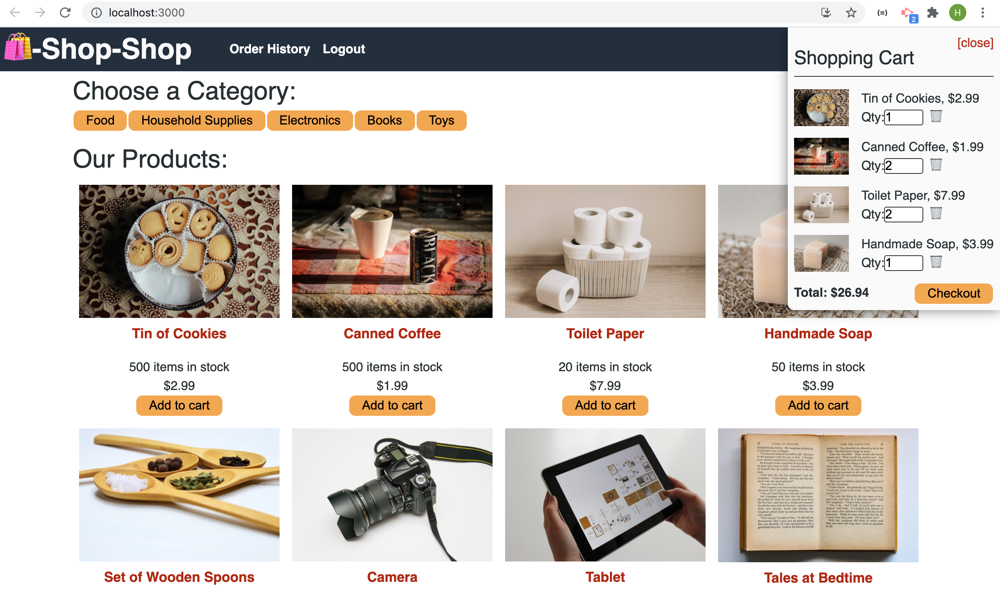
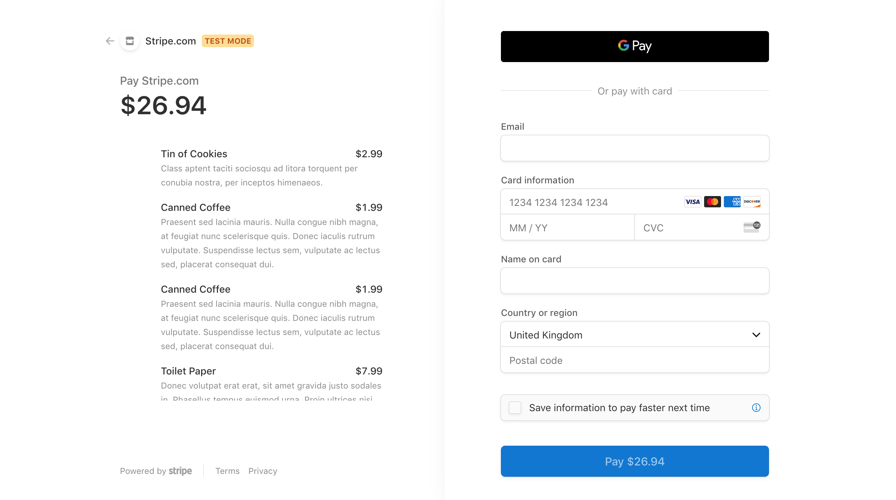

# e-commerce-redux

## Getting Started

```
cd server 
npm i
npm i graphql
npm i redux
npm run seed 
npm run watch
```

```
cd client
npm i
npm run start
```

## Description 

We were asked to to refactor the e-commerce platform using Redux to manage global state instead of the Context API through Redux library. 

import { createStore } from 'redux'

The above is a reducer function that takes a current state value and an action object describing "what happened", and returns a new state value.
A reducer's function signature is: (state, action) => newState
We replaced use reducer with redux. 


## Link

## Screenshots

